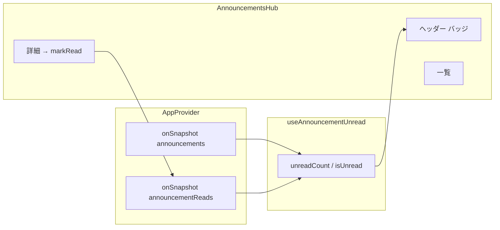

# Rivalt 設計 — お知らせ（種別・UI・未読）

**版:** v0.4 拡張（実装済）  
**前提:** v0.3 で `announcements` CRUD・ホーム掲載。v0.4 でヘッダーメガホン + モーダル UI。

---

## ゴール

1. お知らせに **種別**（重要 / アップデート / 不具合修正）を付け、一覧・詳細で一目で区別できる。
2. 管理者が種別を選び、**テンプレート**からタイトル・本文の雛形を挿入できる。
3. **ログインユーザーごと**に未読を管理し、ヘッダーアイコン右上に **未読件数** を表示する。
4. 「重要があるとアイコンが赤くなる」など、件数以外の強調は行わない。

---

## 1. UI

### 1.1 閲覧（全員）

| 場所 | 挙動 |
|------|------|
| ヘッダー | メガホンアイコン。`createPortal(document.body)` でモーダル（`backdrop-blur` 回避） |
| バッジ | **未読件数のみ**（ログイン時・未読 > 0）。総件数バッジは使わない |
| 一覧モーダル | 種別バッジ・ピン・未読ラベル・1行プレビュー |
| 詳細モーダル | 全文・種別バッジ。右上 ×、下部「一覧に戻る」 |

未ログイン: お知らせの閲覧は可能。未読バッジ・既読記録はなし。

### 1.2 管理（管理者）

- パス: `/admin/announcements`
- 種別を3ボタンで選択
- 選択中の種別に紐づくテンプレートをワンクリック挿入（既存入力がある場合は上書き確認）
- ピン留め・CRUD は v0.3 同様

### 1.3 並び順（クライアント）

1. ピン留め優先（ピン同士も `createdAt` 降順）  
2. それ以外は **`createdAt` 降順**（種別では並べない）

実装: `sortAnnouncements()`（`src/utils/announcementCategory.ts`）

---

## 2. 種別（category）

### 2.1 値

| `category` | 表示ラベル | 用途の目安 |
|------------|------------|------------|
| `important` | 重要 | メンテ・ルール変更など必読 |
| `update` | アップデート | 新機能・シーズン開始など |
| `bugfix` | 不具合修正 | 修正報告・既知の不具合 |

- デフォルト: `update`
- **旧データ**（`category` なし）: アプリ側で `update` 扱い。編集保存時に Firestore へ書き込む。

定義・テンプレート・バッジ色: `src/constants/announcementCategories.ts`

### 2.2 テンプレート（管理者）

種別ごとに複数。例:

- 重要: メンテナンス予告、ルール変更  
- アップデート: バージョンリリース、シーズン開始  
- 不具合修正: 修正のお知らせ、既知の不具合  

**全テンプレート共通の冒頭・末尾**（`wrapAnnouncementTemplateBody` で付与）:

```
皆さん、こんにちは。

Rivalt 運営です。

（種別ごとの本文）

これからも Rivalt をよろしくお願いします。
```

文言の変更は `src/constants/announcementCategories.ts` を編集する（DB には保存しない）。

---

## 3. データ構造

### 3.1 お知らせ本体

**パス:** `leagues/{leagueId}/announcements/{announcementId}`

```ts
type AnnouncementCategory = 'important' | 'update' | 'bugfix'

interface Announcement {
  id: string
  title: string
  body: string
  category?: AnnouncementCategory  // 新規・更新時は必須（Rules）
  isPinned: boolean
  authorUid: string
  createdAt: Timestamp
  updatedAt: Timestamp
}
```

制限: タイトル 60 文字、本文 2000 文字（`ANNOUNCEMENT_LIMITS`）。

### 3.2 既読（ユーザーごと）

**パス:** `leagues/{leagueId}/players/{uid}/announcementReads/{announcementId}`

```ts
interface AnnouncementRead {
  readAt: Timestamp
}
```

- お知らせ 1 件 × ユーザー 1 人 = 最大 1 ドキュメント  
- `uid` は Firebase Auth UID（プレイヤードキュメント ID と同じ）  
- プレイヤー未登録でも、ログイン済みなら既読パスは利用可能（サブコレクションのみ）

---

## 4. 未読の仕組み

### 4.1 考え方

「最後に読んだ版」と「お知らせの現在の版」を比較する。

- **お知らせの版（リビジョン）**  
  `revisionMs = max(createdAt, updatedAt)`（ミリ秒）
- **既読時刻**  
  `announcementReads/{id}.readAt`（なければ `0`）
- **未読**  
  `revisionMs > readAtMs`

管理者がお知らせを **編集** すると `updatedAt` が進み、再度未読になる。

### 4.2 既読にするタイミング

| 操作 | 既読 |
|------|------|
| 一覧モーダルを開く | しない |
| 詳細モーダルを開く | する（`markAnnouncementRead(id)`） |

一覧だけでは未読のまま。詳細を開いた時点で `readAt: serverTimestamp()` を merge 書き込み。

### 4.3 クライアントのデータフロー



1. 全員: `announcements` を購読  
2. ログイン時: `players/{uid}/announcementReads` を購読 → `announcementReadAtMs: Record<id, ms>`  
3. `countUnreadAnnouncements()` で未読件数  
4. 詳細表示時に `setDoc(..., { readAt }, { merge: true })`  
5. 既読購読が更新され、バッジ・一覧の「未読」表示が減る  

### 4.4 判定ロジック（参照）

`src/utils/announcementRead.ts`

```ts
function getAnnouncementRevisionMs(a: Announcement): number
function isAnnouncementUnread(a, readAtMsById): boolean
function countUnreadAnnouncements(announcements, readAtMsById): number
```

---

## 5. Firestore Rules

### 5.1 announcements

- 閲覧: 全員  
- 作成・更新・削除: リーグ管理者  
- `category` は `important` | `update` | `bugfix` のみ（作成・更新とも必須）

### 5.2 announcementReads

`players/{playerId}` 配下:

```
match /announcementReads/{announcementId} {
  allow read: if signedIn && playerId == auth.uid;
  allow create, update: if signedIn && playerId == auth.uid
    && keys == ['readAt'] && readAt == request.time;
  allow delete: if false;
}
```

**デプロイ必須**（未デプロイ時は既読書き込みが permission-denied）:

```bash
npx firebase deploy --only firestore:rules
```

---

## 6. 実装ファイル一覧

| 役割 | パス |
|------|------|
| 型 | `src/types/index.ts` |
| 種別・テンプレート | `src/constants/announcementCategories.ts` |
| 並び順 | `src/utils/announcementCategory.ts` |
| 未読判定 | `src/utils/announcementRead.ts` |
| 購読・既読書き込み | `src/context/AppProvider.tsx` |
| 未読 hook | `src/hooks/useAnnouncementUnread.ts` |
| 閲覧 UI | `src/components/home/AnnouncementsHub.tsx` |
| 種別バッジ | `src/components/AnnouncementCategoryBadge.tsx` |
| 管理画面 | `src/pages/AdminAnnouncementsPage.tsx` |
| ヘッダー接続 | `src/components/Header.tsx` |
| Rules | `firestore.rules` |

---

## 7. 受け入れ条件（チェックリスト）

- [x] 種別バッジが一覧・詳細・管理一覧に表示される
- [ ] 管理者が種別を選び、テンプレートで本文を挿入できる
- [x] ログイン時、未読があるとメガホン右上に未読数（9+ 上限）
- [x] 未ログイン時、バッジは出ない
- [x] 一覧のみでは未読のまま、詳細を開くと既読・バッジ減少
- [x] お知らせ編集後、再度未読になる
- [x] `main` / `dev` でお知らせ・既読が混ざらない（`VITE_LEAGUE_ID`）
- [x] Rules デプロイ後、既読が Firestore に保存される

---

## 8. テスト観点（追記用）

| ID | 観点 |
|----|------|
| TC-AN-UN1 | ログイン・未読あり → バッジ表示 |
| TC-AN-UN2 | 詳細閲覧 → バッジ減・既読 doc 作成 |
| TC-AN-UN3 | 管理者がお知らせ更新 → 再び未読 |
| TC-AN-UN4 | 未ログイン → バッジなし・閲覧可 |
| TC-AN-CAT1 | 3 種別の投稿・バッジ色 |
| TC-AN-CAT2 | テンプレート挿入 |

（正式な手順は `test-cases-v0.4.md` 等へ追記可）

---

## 9. 意図的にやらないこと（v0.4 時点）

- プッシュ通知・メール通知  
- お知らせごとの既読者一覧（管理者向け）  
- 下書き・公開予約  
- 未ログイン向け localStorage 既読（端末ローカルのみの未読は未実装）  
- 一覧を開いただけで一括既読  

---

## 関連

- [`design-v0.4.md`](./design-v0.4.md) — ホーム UI 整理（メガホン・モーダル）
- [`design-v0.3.md`](./design-v0.3.md) — お知らせ CRUD 初版
- [`roadmap.md`](./roadmap.md)
- [`status.md`](./status.md)
